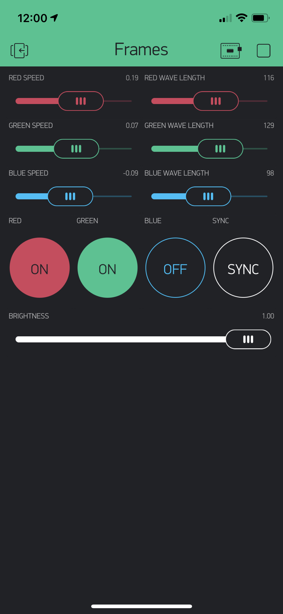

# Frames
Backlit picture frames controlled wirelessly using [Blynk](https://blynk.io/).
>Made for and tested on NodeMCU 1.0 driving WS2812b LEDs.

## Light Pattern
The light pattern is constructed of traveling red, green, and blue sine waves.
Each sine wave has its own speed, direction, and wavelength.
Dynamic color patterns are formed as the waves travel and intersect each other.

## Control
The wave parameters are controlled via a Blynk app.

## WiFi
This program uses WiFiManager.
If the device can not connect to the previously connected WiFi network, it will create an access point. A phone can connect to this network and configure the WiFi settings via the captive portal.

## Setup
Create a `creds.h` file in the root directory and define your Blynk auth token as `TOKEN`.
